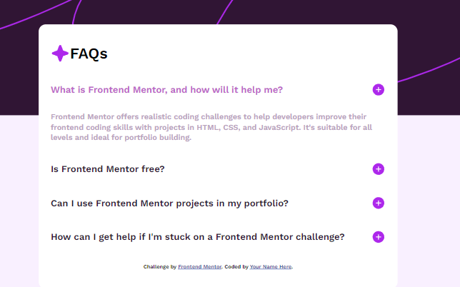
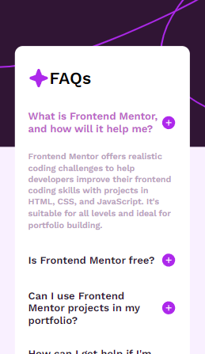

# Frontend Mentor - FAQ accordion solution

This is a solution to the [FAQ accordion challenge on Frontend Mentor](https://www.frontendmentor.io/challenges/faq-accordion-wyfFdeBwBz). Frontend Mentor challenges help you improve your coding skills by building realistic projects. 

## Table of contents

- [Overview](#overview)
  - [The challenge](#the-challenge)
  - [Screenshot](#screenshot)
  - [Links](#links)
- [My process](#my-process)
  - [Built with](#built-with)
  - [What I learned](#what-i-learned)
  - [Continued development](#continued-development)
  - [Useful resources](#useful-resources)
- [Author](#author)
- [Acknowledgments](#acknowledgments)

**Note: Delete this note and update the table of contents based on what sections you keep.**

## Overview

### The challenge

Users should be able to:

- Hide/Show the answer to a question when the question is clicked
- Navigate the questions and hide/show answers using keyboard navigation alone
- View the optimal layout for the interface depending on their device's screen size
- See hover and focus states for all interactive elements on the page

### Screenshot

### Links

- Solution URL: [Gitr Hub Repository](https://github.com/micaji-251/PFEM_Accordion)

- Live Site URL: [Add live site URL here](https://your-live-site-url.com)

## My process

### Built with

- Semantic HTML5 markup
- CSS custom properties
- Flexbox
- Mobile-first workflow
- DOM
- JS Events

### What I learned

In the body i had to apply multiple backgrounds, an image and color.
In the css, i has to add flexbox with buttons in the extreme right i had to evaluate to use space-between or not use flexbox and use float:right.
In the Js i had to use DOM to get the elements i needed to be able to show and hide elements. Also i applied logic to be able to evaluate if it is already open hide and vice versa.

### Continued development

My objetive is to improve my css and js logic to optimize resources.

### Useful resources

- [Backgound image](https://developer.mozilla.org/en-US/docs/Web/CSS/background-size) - This helped me to use multiple backgrounds.

## Author

- Website - [Micaela Jimenez](https://www.your-site.com)
- Frontend Mentor - [@micaji-251](https://www.frontendmentor.io/profile/yourusername)

